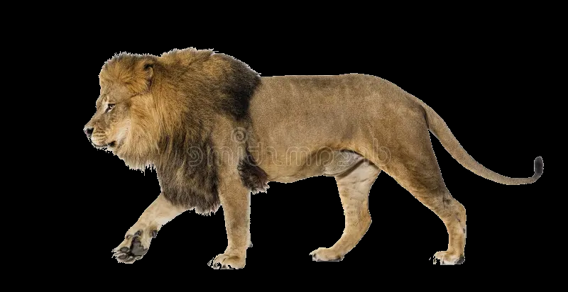
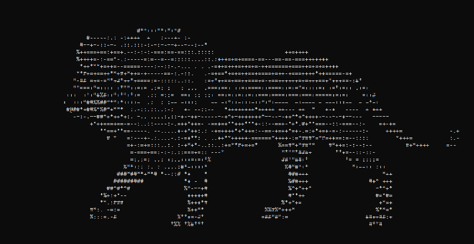

# ToASCII a Project Example
*This project is for an example to show what a decent layout of a project could be.*
### Main contributors
- William VB

## Description
 Converts a Pillow(PIL) Image into a string of characters that represent the intensity of the pixels in the image.
  
  In less technical terms, this function turns an image into ASCII art.
 
## Project Status
COMPLETED ON **20-10-2024 (DD-MM-YYYY)**

## Usage

### ToASCII Usage Requirements
This project uses Python and thus you need to have it installed on your computer, to use this.
The project also uses some external libraries that may need to be installed. See bellow.
- [Python Installation Guide](https://wiki.python.org/moin/BeginnersGuide/Download)
- [Pilliow](https://python-pillow.org/) for importing images and some processing. [Pillow Intallation Guide](https://pillow.readthedocs.io/en/stable/installation/basic-installation.html)
### Signature
```python
#Primary Function Signature  
convert_image_to_ascii(
    image : Image , 
    output_width : int = 80 , 
    output_height : int = -1 ,
    character_set : string = " `:;+#@" , 
    delimiter : chr = '\n'
    ) -> string :
	"""
	Keyword arguments: 
        image (Pillow Image) -- The image you want to convert. 
    
        output_width (int , default 80) -- The output width in characters. 
        Set to -1 to adjust width to keep aspect ratio.
    
        output_height (int , default -1) -- The output height in characters. 
        Set to -1 to adjust height to keep aspect ratio.
    
        character_set (string , default "`:;+#@") -- The characters ordered 
        from Dark -> Light that are selected to form the ASCII image.
    
        delimiter (chr , default '/n') -- The separator for each line of 
        characters.
	"""
		
``` 

### Code Example
```python
from Pillow import image
import ToASCII

PATH = "C:/PATH/TO/IMAGE"
my_image = Image.open(PATH);

print( ToASCII.convert_image_to_ascii( my_image))
``` 
## Possible Bugs and Issues
- !!Issues may arise if you set an output height or output width to zero!!
- !!Be warred an large output width and height takes a lot of processing!!

## Example Application

### Converting Image Sequences 

#### INPUT  

#### OUPUT  


---
### Converting Images

#### INPUT 

#### OUPUT 


## TECHNICAL DOC
Goes in depth in to aspects of the project. This is due to the README is more of a landing page for users not developers of the project.  
[LINK TO TECHNICAL DOC](./TECHNICALDOC.md)
